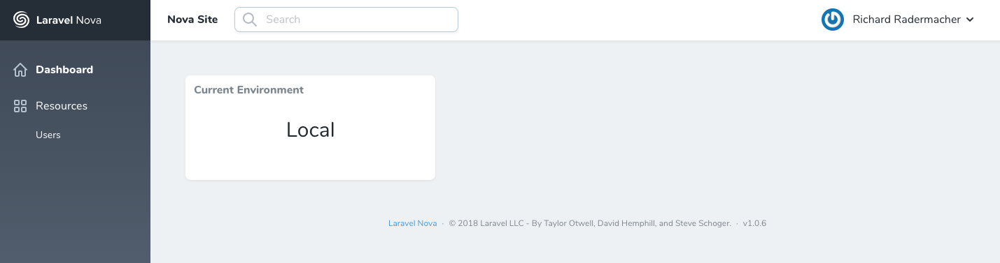

# Current Environment Card for Nova

[](https://packagist.org/packages/radermacher/nova-current-environment-card)
[](https://packagist.org/packages/radermacher/nova-current-environment-card)



## Installation

You can install the package in to a Laravel app that uses [Nova](https://nova.laravel.com) via composer:

```bash
composer require radermacher/nova-current-environment-card
```

Next up, you must register the card with Nova. This is typically done in the `cards` method of the `NovaServiceProvider`.

```php
// in app/Providers/NovaServiceProvider.php

// ...

public function cards()
{
    return [
        // ...
        new \Radermacher\NovaCurrentEnvironmentCard\NovaCurrentEnvironmentCard,
    ];
}
```

## Localization

Publish the package language files to your application's `resources/lang/vendor` directory:
```
php artisan vendor:publish --provider="Radermacher\NovaCurrentEnvironmentCard\CardServiceProvider"
```

## Credits
- [Richard Radermacher](https://github.com/radermacher)
- [All Contributors](../../contributors) 

## License

The MIT License (MIT). Please see [License File](LICENSE.md) for more information.
